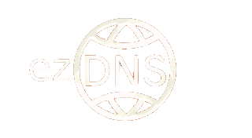

    <h2 align="center">ezDNS</h2>

    A PS3 DNS configuration application for custom DNS profiles.

<h3>Introduction</h3>

ezDNS makes managing custom network settings effortless by letting you create, save, and switch between multiple DNS profiles. Whether you’re connecting to custom game servers or revival projects, you can load the save the profile, and load it at any time.

<h3>Installation & Usage</h3>
TODO

<h3>Building</h3>

You will need to build and install the psl1ght toolchain and ps3libraries.

For debugging use flags:

<pre><code>-DDEBUG -DDEBUG_ADDR=\"x.x.x.x\" -DDEBUG_PORT=\"18194\"</code></pre>

You can use <code>udpdebug.py</code> to view debugging output. Or something like Netcat on linux.

If you are using ps3loadx, use flag <code>-DPS3LOADX</code> to exit the application back to ps3loadx.

<h3>Screenshots</h3>

<h3>Credits</h3>

tiny3d 2.0 + libfont: <a href='https://github.com/crystalct/tiny3D'>crystalct/tiny3D</a>

<h3>License</h3>

This software is licensed under the <a href=''>MIT License</a>.

This application was created with the official non-official SDK called PSL1GHT, for more information visit <a href='http://www.psl1ght.com/'>http://www.psl1ght.com/</a>. This is in no way associated with Sony Computer Entertainment Inc., please do not contact them for help, they will not be able to provide it.
